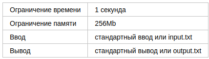
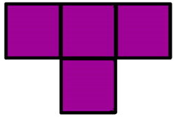
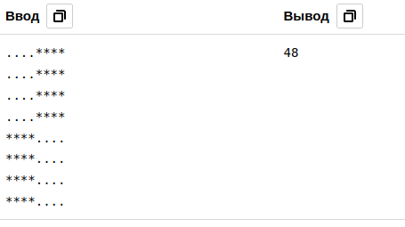
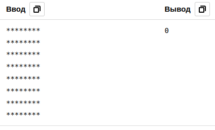
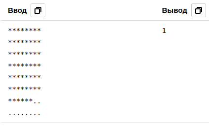

# A. Тетрамино

На шахматном поле 8×8 некоторые клетки пустые, а некоторые заняты фигурами.

Определите количество способов разместить тетрамино на этом поле, чтобы фигура занимала целиком четыре свободные клетки.

В задаче мы рассматриваем тетрамино только одного типа. 

## Формат ввода

Входные данные состоят из 8 строк по 8 символов. Пустая клетка задается точкой (‘.’), а занятая звездочкой (‘*’).

## Формат вывода

Выведите количество способов разместить тетрамино на поле.

# Пример 1

# Пример 2

# Пример 3
