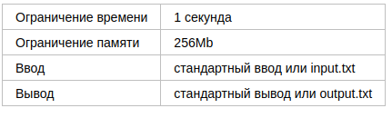
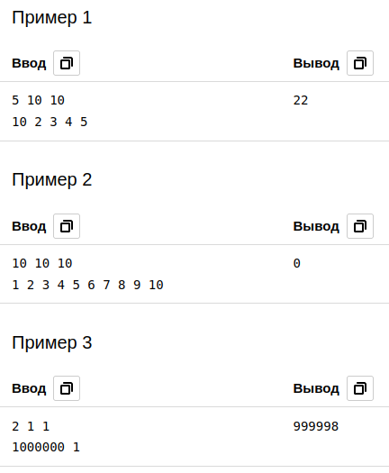

# B. Заезд

На кольцевой трассе расположены n гоночных автомобилей. Наша цель оценить зрелищность заезда — количество обгонов в будущей гонке!

Для простоты будем считать, что все автомобили стартуют в одно время из одной точки и движутся с постоянной скоростью: скорость i-го автомобиля vi.

Определите количество обгонов, которые **совершит автомобиль с номером 1**, за время t, если длина кольцевого трека равна s.

Обратите внимание, что в один момент времени автомобиль может совершить сразу несколько обгонов. Автомобили, находящиеся в одной точке в момент времени 0 и t, не совершают обгонов. 

## Формат ввода

В первой строке записаны три целых числа n, t и s (2 ≤ n ≤ 1_000_000, 1 ≤ t, s ≤ 1_000_000).

Во второй строке записаны n целых чисел v1, v2, …, vn (1 ≤ vi ≤ 1_000_000). Все vi различны. 

## Формат вывода

Выведите количество обгонов в предстоящем заезде.

