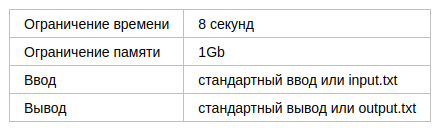
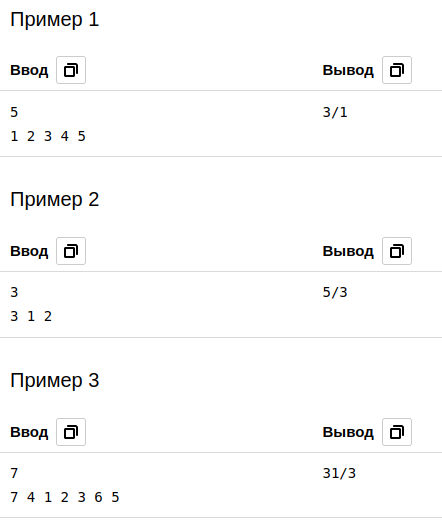

# C. Инверсии

Пусть p1, p2, …, pn перестановка чисел от 1 до n. Будем говорить, что пара индексов (i,j) образует инверсию, если i<j и pi>pj.

Задана некоторая перестановка (p1,…,pn), требуется определить среднее количество инверсий в перестановке, полученной из данной
после одной перестановки пары элементов. При этом индексы переставляемых элементов выбираются **равновероятно** среди всех пар 
различных чисел от 1 до n. 

## Формат ввода

В первой строке записано одно целое число n (2 ≤ n ≤ 2000).

Во второй строке записаны n целых чисел p1, p2, …, pn (1 ≤ pi ≤ n), все числа в строке различны. 

## Формат вывода

Выведите несократимую дробь a∕b, задающую значение среднего числа инверсий по всем возможным парам переставляемых индексов элементов.

