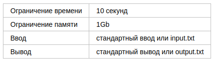
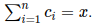

# D. Округление

Иногда при округлении к ближайшему всех слагаемых по отдельности получается совсем другая сумма: 

Необходимо придумать метод округления, при котором суммарная абсолютная разность элементов двух последовательностей минимальна, а сумма совпадает.

Заданы натуральные числа a1, a2, …, an и x. Последовательность bi определяется по следующей формуле: 

Нужно найти последовательность целых чисел ci такую, что  минимальна и 

## Формат ввода

В первой строке записаны два целых числа n и x (1 ≤ n ≤ 1000000, 1 ≤ x ≤ 1000000).

Во второй строке записаны n целых чисел a1, a2, …, an (1 ≤ ai ≤ 1000000).

## Формат вывода

Выведите n целых чисел c1, c2, …, cn (0 ≤ ci ≤ x). Числа в сумме должны давать значение x.

Если подходящих последовательностей несколько, выведите любую из них. 

# Пример 1

# Пример 2

# Пример 3

# Пример 4

# Пример 5

