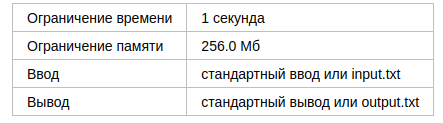
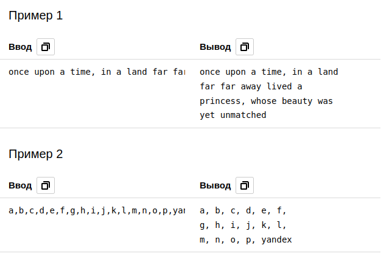

# A. Форматирование текста

Если вы используете язык C++, то для считывания входных данных в этой задаче вам может понадобиться функция std::getlinestd. Подробнее про неё можно прочитать здесь

Дан текст из строчных английских букв, пробелов и запятых. Пусть len равно максимальной длине слова в тексте, умноженной на 33. Вам необходимо отформатировать текст следующим образом:

    * в каждой строке должно быть не более lenlen символов
    * запятая «приклеивается» к слову перед ней, то есть должна находиться на одной строке с ним
    * перед запятой пробел не ставится
    * после запятой пробел ставится, если она не является последним символом строки
    * если слово не входит на строку ii, строка ii заканчивается, а слово будет записано на строке (i+1)(i+1)
    * последним символом в любой строке должна быть буква или запятая

## Формат ввода

В единственной строке ввода находится строка ww (1≤∣w∣≤10^5) из строчных английских букв, запятых и пробелов.

Гарантируется, что:

    * в тексте между любыми двумя запятыми есть непустое слово
    * текст начинается с буквы
    * в тексте нет двух пробелов подряд

## Формат вывода

Выведите текст, отформатированный в соответствии с условием задачи.

## Примечания

В первом примере наиболее длинным словом является слово «unmatched», поэтому len=9 и в каждой строке отформатированного текста должно быть не более 27 символов. Первая запятая относится к слову «time», а вторая — к слову «princess», поэтому в отформатированном тексте эти запятые идут сразу же после соответствующих слов. После запятых поставлено по одному пробелу.

Во втором примере наиболее длинным словом является слово «yandex», поэтому len=6. В каждой строке отформатированного текста должно быть не более 18 символов. Первая строка отформатированного текста содержит 17 символов, так как, чтобы поместить на неё следующее слово, необходимо добавить 3 символа: пробел, «g» и «,».

