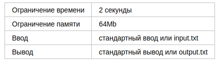
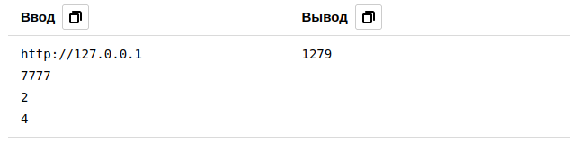

# Сложение чисел

Разработчики бекенда часто взаимодействуют с многочисленными API, результаты которых нужно
ещё и дополнительно обрабатывать. Сейчас вам придётся сделать именно это!

Во входном файле четыре строчки. В первой находится URL сервера, во второй — номер порта.
В следующих двух строках записаны два целых 32-разрядных числа: соответственно, a и b.
Необходимо осуществить GET-запрос к серверу по указанному номеру порта, передав значения 
чисел a и b в значениях одноимённых параметров запроса. Сервер ответит JSON-массивом из
целых чисел. Сумму этих чисел необходимо распечатать в выходной файл.

Гарантируется, что общее количество чисел в ответе не превосходит 100, при этом каждое 
из них — 32-разрядное знаковое целое число.

## Формат ввода

Строка — URL сервера.

Целое число — порт сервера.

Целое число — число a.

Целое число — число b.

## Формат вывода

Единственная строка выходного файла должна содержать целое число, равное сумме чисел из ответа сервера. 

## Пример

## Примечания

Для решений на языке Java доступна библиотека json-simple версии 1.1.1. Соответствующие 
функции импорта могут иметь вид:

import org.json.simple.JSONArray;  

import org.json.simple.JSONObject;  

import org.json.simple.parser.JSONParser;  

import org.json.simple.parser.ParseException;

Пример ответа сервера для первого теста:
curl "http://127.0.0.1:7777?a=2&b=4"  
[  
8,  
6,  
-2,  
2,  
4,  
17,  
256,  
1024,  
-17,  
-19  
]
