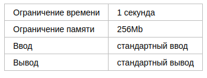
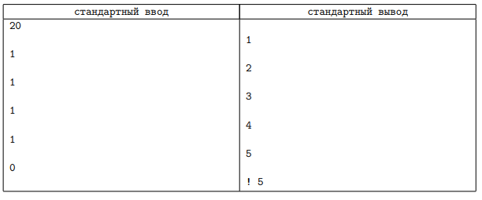

# D. Поиск ломающего коммита

В Поиске Яндекса реализована так называемая политика «зелёного транка»: любой код, 
попадающий в репозиторий, с некоторыми оговорками гарантированно не ломает сборку и тесты.

Тесты, впрочем, бывают крайне сложными, и запускать их все на каждый коммит оказывается
нецелесообразно. Так что для особенно сложных случаев реализована следующая процедура:
тесты запускаются с некоторой регулярностью, а проверяется сразу набор коммитов. Таким
образом, в течение некоторого времени в транк может попасть n непроверенных коммитов, 
среди которых как минимум один содержит ошибку.

В такой ситуации тестирующая система должна обнаружить номер m первого коммита, сломавшего тесты.
Этот номер обладает следующим свойством: все коммиты с номерами, меньшими m, успешно проходят
тесты, а коммиты с номерами, большими либо равными m, тесты не проходят. В данной задаче
гарантируется, что коммит с указанными свойствами обязательно существует и является единственным.

В целях экономии ресурсов тестирующая система может проверять только один коммит за раз.
Вам требуется написать программу, которая будет определять номер m.

Эта задача немного необычна — в ней вам предстоит реализовать интерактивное взаимодействие
с тестирующей системой. Это означает, что вы можете делать запросы и получать ответы в
онлайн-режиме. Обратите внимание, что ввод/вывод в этой задаче — стандартный (то есть с
экрана на экран). После вывода очередного запроса обязательно используйте функции очистки 
потока, чтобы часть вашего вывода не осталась в каком-нибудь буфере. Например, на С++ надо
использовать функцию fflush(stdout), на Java вызов System.out.flush(), на Pascal flush(output)
и stdout.flush() для языка Python.

Вы можете делать запросы к тестирующей системе. Каждый запрос — это вывод целого числа, 
принадлежащего диапазону от 1 до n. В ответ тестирующая система вернёт один из двух результатов:

* строка «1» (без кавычек), если коммит с соответствующим номером успешно проходит все тесты;
* строка «0» (без кавычек), если коммит с соответствующим номером не проходит тесты.

Если ваша программа в точности знает номер m, она должна вывести строку вида «! m», после чего 
завершить свою работу.

Вашей программе разрешается сделать не более 25 запросов.

## Формат ввода

Для чтения ответов на запросы программа должна использовать стандартный ввод.

В первой строке входных данных будет содержаться целое положительное число n *(1≤n≤106)* — 
количество совершённых коммитов.

В следующих строках на вход вашей программе будут подаваться строки, содержащие пары 
символов «1» или «0». *i-я* из этих строк является ответом системы на ваш *i-й* запрос.
После того, как ваша программа угадала номер коммита, выведите «! m» (без кавычек),
где m — это ответ, и завершите работу своей программы.

Тестирующая система даст вашей программе прочитать ответ на запрос из входных данных только 
после того, как ваша программа вывела соответствующий запрос системе и выполнила операцию flush.

## Формат вывода

Для осуществления запросов программа должна использовать стандартный вывод.

Ваша программа должна выводить запросы — целые числа *ai (1≤ai≤n)*, по одному на строку
(не забывайте выводить «перевод строки» после каждого выведенного числа). После вывода
каждой строки программа должна выполнить операцию flush.

Каждое из чисел ai обозначает очередной запрос к системе. Ответ на запрос программа сможет
прочесть из стандартного ввода. В случае, если ваша программа угадала число m, выведите
строку вида «! m» (без кавычек), где m — ответ, после чего завершите работу программы.

