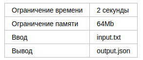
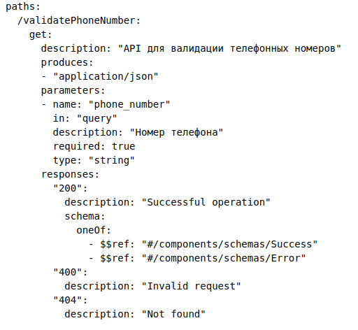
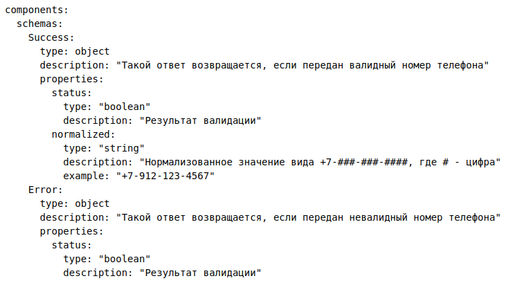
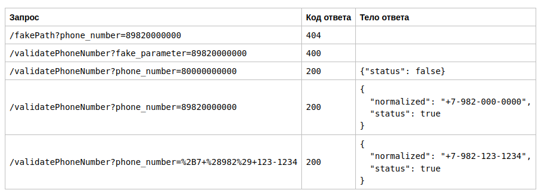

# Сервис валидации телефонных номеров

Перед командой разработки поставили задачу — написать сервис валидации телефонных номеров.
Прежде чем приступить к реализации собрали требования к задаче. Сначала, платформа, на которой
будет развернуто ваше приложение, имела пару требований:

* сервис должен прослушивать порт 7777 на локальном хосте (127.0.0.1:7777);
* интерфейс GET /ping должен отвечает статус-кодом 200, когда приложение готово обрабатывать запросы; 
* HTTP-интерфейс GET /shutdown должен немедленно завершать исполнение сервиса (статус-код в данном случае не важен).

Затем сформулировали спецификацию к функциональной части сервиса в формате OpenAPI:
swagger: "2.0"  

В спецификации указан регистрозависимый path. Сервис должен обрабатывать параметры query, которые
задекларированы в спецификации, остальные параметры должны быть проигнорированы. Запросы
закодированы в версии HTTP/1.0. В ответ на запрос с неверным path возвращаем код 404. В ответ на
запрос с неверными параметрами query возвращаем код 400. В остальных случаях возвращаем код 200
с детализированным ответом внутри.

Номера телефонов могут иметь форматы:

* "+7 code ### ####
* +7 code ### ## ##
* +7 (code) ###-####
* +7code#######
* 8 code ### ####
* 8 code ### ## ##
* 8 (code) ###-####
* 8code#######

Здесь # — цифра, code — код оператора из списка [982, 986, 912, 934]

## Пример

## Примечания

Для решений на языке Java доступна библиотека json-simple версии 1.1.1. Соответствующие директивы import могут иметь вид:
import org.json.simple.JSONArray;  
import org.json.simple.JSONObject;  
import org.json.simple.parser.JSONParser;  
import org.json.simple.parser.ParseException;