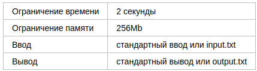

# Опять JSON’ы перекладывать...

Всем хотя бы раз в жизни приходилось перекладывать JSON’ы. Вот и для нового проекта под 
названием «Единое хранилище» необходимо переложить магазинные фиды. Для размещения на 
Яндекс.Маркете магазины передают товары из своего ассортимента в JSON-файлах. Одно
товарное предложение описывается так:
{  
"offer_id": <string>,  
"market_sku": <int>,  
"price": <int>  
}

где offer_id — уникальный среди всех фидов магазина идентификатор предложения, 
market_sku — идентификатор товара на Яндекс.Маркете, price — стоимость товара.

Весь фид магазина представляет собой JSON и выглядит так:
{  
"offers": [<offer>, <offer>, ...]  
}

Вас попросили написать программу, которая объединит все фиды одного магазина в единый фид.

## Формат ввода

На первой строке входных данных содержится целое число n — количество фидов магазина (1≤n≤200). Следующие n строк содержат по одному магазинному фиду на строку. Гарантируется, что строка является валидным JSON-ом и удовлетворяет формату фида. Количество товарных предложений в одном фиде не превышает 200. offer_id состоит из строчных и заглавных букв латинского алфавита и цифр, 1≤|offer_id|≤10, 1≤market_sku≤231−1, 1≤price≤106.

## Формат вывода

Выходной поток должен содержать один JSON-документ, удовлетворяющий формату товарного фида. Порядок товарных предложений, количество строк в документе и табуляция не имеют значения.

## Пример

### Ввод

2  
{"offers": [{"offer_id": "offer1", "market_sku": 10846332, "price": 1490}, {"offer_id": "offer2", "market_sku": 682644, "price": 499}]}  
{"offers": [{"offer_id": "offer3", "market_sku": 832784, "price": 14000}]}

### Вывод

{"offers":[{"market_sku":10846332,"offer_id":"offer1","price":1490},{"market_sku":682644,"offer_id":"offer2","price":499},{"market_sku":832784,"offer_id":"offer3","price":14000}]}

### Примечание

Для решений на языке Java доступна библиотека json-simple версии 1.1.1. Соответствующие import’ы могут выглядеть так:  
import org.json.simple.JSONArray;  
import org.json.simple.JSONObject;  
import org.json.simple.parser.JSONParser;  
import org.json.simple.parser.ParseException;  
