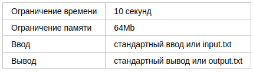
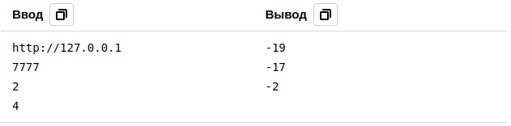

# Сортировка отрицательных чисел

Разработчики бэкенда часто взаимодействуют с многочисленными API и дополнительно обрабатывают результаты. 
Сейчас вам придется сделать именно это!

Во входном файле четыре строчки. В первой находится адрес сервера, во второй — номер порта. В следующих двух
строках записаны два целых 32-разрядных числа: a и b. Необходимо осуществить GET-запрос к серверу по указанному
номеру порта, передав значения чисел a и b в значениях одноименных CGI-параметров. Сервер ответит JSON-массивом
из целых чисел. Необходимо отсортировать числа в порядке неубывания и распечатать в выходной файл отрицательные 
числа — по одному числу в строке.

Гарантируется, что общее количество чисел в ответе не превосходит 100, при этом каждое из них — 32-разрядное
знаковое целое число.

## Формат ввода

Строка — URL сервера.  
Целое число — порт сервера.  
Целое число — число a.  
Целое число — число b.  

## Формат вывода

Целые отрицательные числа, отсортированные по неубыванию, из списка в ответе сервера, по одному в строке. 

## Пример

### Примечания

Для решений на языке Java доступна библиотека json-simple версии 1.1.1. 
Соответствующие import’ы могут выглядеть так:  
import org.json.simple.JSONArray;  
import org.json.simple.JSONObject;  
import org.json.simple.parser.JSONParser;  
import org.json.simple.parser.ParseException;

Пример ответа сервера для первого теста:

curl "http://127.0.0.1:7777?a=2&b=4"  
[  
8,  
6,  
-2,  
2,  
4,  
17,  
256,  
1024,  
-17,  
-19  
]

