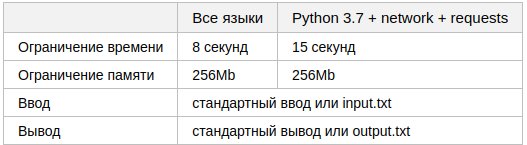
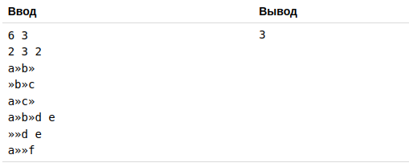

# Поиск похожих строк

Проект новой базы данных должен объединить в себе разрозненную информацию обо всех объектах. 
Думаете, это не возможно? Достаточно лишь правильно определить понятие «всех»...

К сожалению, после создания базы данных выяснилось, что некоторые объекты встречаются в ней
несколько раз. Кроме того, много данных пропущено. Чтобы оценить масштаб бедствия, нужно
определить количество потенциально одинаковых объектов в базе. База данных состоит из строк
и столбцов, при этом каждый столбец может быть и заполненным, и пустым для каждого объекта.
Часть столбцов названы важными, их наличие существенно для определения одинаковости объектов.
Назовем две различные строки в базе данных потенциально одинаковыми, если у них есть хотя бы
один общий столбец, заполненный одинаковым не пустым значением и хотя бы у одного из объектов
все важные столбцы заполнены непустыми значениями. Кроме того, все столбцы, которые непусты
в обеих строчках одновременно, должны содержать одинаковые значения.

## Формат ввода

В первой строке заданы два целых числа, разделенных пробелом: *N, K (1≤N≤4⋅104, 1≤K≤7)* — число
строк и столбцов в базе данных.

Во второй строке записано целое число *S (1≤S≤K)* — количество важных столбцов. За ним в этой же
строке через пробел следуют *S* различных номеров важных столбцов *1≤i1,…,iS≤K*, разделенных пробелами.

В следующих *N* строках записаны строки базы данных, состоящие из K значений, разделенных символами
табуляции. Значения состоят из символов с ASCII-кодами 32–127. Суммарная длина всех значений не 
превосходит 106.

## Формат вывода

Выведите одно число — количество неупорядоченных пар потенциально одинаковых строк базы данных. 

### Пример 

## Примечание

В примере символ табуляции заменен », чтобы его можно было отличить от пробела. В первом примере
потенциально одинаковы пары строк (1, 2) (по второму столбцу, у строки 2 заполнены все важные
столбцы), (1, 4) (по первому и второму столбцу, у строки 4 заполнены все важные столбцы), (4, 5)
(по третьему столбцу, у строки 4 заполнены все важные столбцы). 