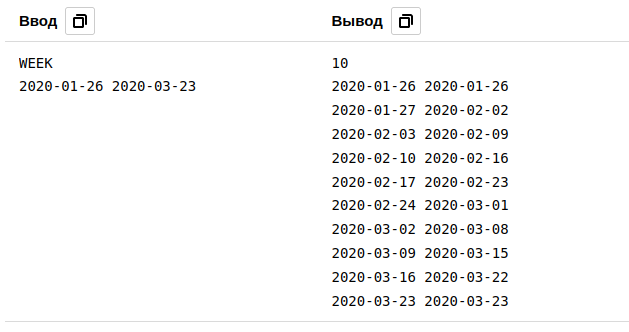

# Разбиение на интервалы дат

Миша работает в команде Яндекс.Маркета, которая предоставляет производителям товаров аналитику о
продажах. Сейчас Миша разбирается с периодизацией: нужно собирать данные по дням, неделям, месяцам,
кварталам и годам. От клиентов приходят запросы, в которых указан период детализации и интервал:
начальная и конечная даты. Так что первоначально Мише нужно разбить интервал на периоды. Так,
если клиент хочет данные с 2020-01-10 по 2020-03-25 с детализацией по месяцам, то ему вернутся
данные за три периода: c 2020-01-10 по 2020-01-31, с 2020-02-01 по 2020-02-29 и с 2020-03-01 по
2020-03-25. Помогите Мише, а то ему еще диплом писать надо!

Всего нужно поддержать пять видов временных интервалов:

* WEEK — неделя с понедельника по воскресенье.
* MONTH — месяц.
* QUARTER — интервалы в три месяца: январь — март, апрель — июнь, июль — сентябрь, октябрь — декабрь.
* YEAR — год c 1 января по 31 декабря.
* FRIDAY_THE_13TH — интервал с пятницы 13-го по ближайший четверг 12-го.

## Формат ввода

В первой строке дан типа интервала type — строка, принимающая одно из следующих значений:
WEEK, MONTH, QUARTER, YEAR, FRIDAY_THE_13TH. Во второй строке через пробел даны начальная и
конечная даты start и end (start≤end) в формате yyyy-MM-dd. Гарантируется, что обе даты лежат 
в промежутке с 1 января 2000 года по 31 декабря 3999 года включительно.

## Формат вывода

В первой строке ответа выведите одно целое число N — количество промежутков. В последующих N 
строках на i-й строке выведите через пробел дату начала и конца i-го промежутка в формате 
yyyy-MM-dd. Промежутки должны выводиться в порядке возрастания начальной даты. 

### Пример 1

### Пример 2

### Пример 3

