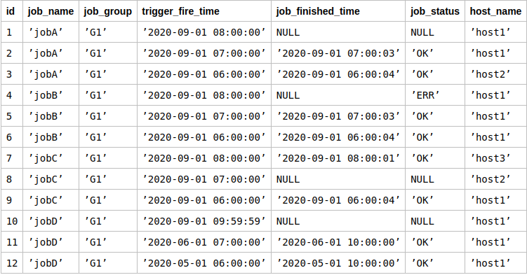
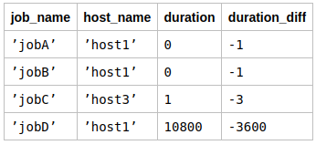

# Что? Где? Как?

Саша работает в Яндексе. Функционирование сервиса, который разрабатывает его команда, зависит от множества задач,
выполняющихся по расписанию. Иногда эти задачи падают или выполняются слишком долго. Тимлид попросил Сашу подготовить
данные для системы мониторинга на основе истории выполнения задач. Так ребята смогут увидеть проблемы на графиках
и получать уведомления в чат. Задачу Саше дали в пятницу вечером, он поехал на машине на дачу и по дороге, чтобы не
заскучать за рулем, думал о том, каким запросом ее можно решить. 
Примерно на границе Московской области решение было найдено. Попробуйте и вы!

## Формат ввода

Подсистема запуска задач создает таблицу логов следующим запросом:

create table qrtz_log (  
id integer primary key autoincrement not null,  
job_name varchar(80) not null,  
job_group varchar(80) not null,  
trigger_fire_time timestamp with time zone not null,  
job_finished_time timestamp with time zone,  
job_status varchar(200),  
host_name varchar(80) not null,  
constraint con_name_group_fire_time unique (  
job_name, job_group, trigger_fire_time, host_name  
)  
);

## Формат вывода
Нужно написать запрос, который для каждого уникального значения колонки job_name возвращает:

* duration — продолжительность выполнения задачи в секундах или ноль, если задача упала. Целое число. Подробные правила вычисления описаны далее.
* job_name — название задачи.
* host_name — хост, на котором задача выполнялась в последний раз, если duration > 0, или упала в последний раз, если 
duration = 0.
* duration_diff — разница между двумя последними успешными запусками задачи. Если успешных запусков было меньше двух, 
то равен нулю.

duration вычисляется по первому сработавшему правилу из списка:

* duration = 0 если последний запуск задачи упал.
* Последний запуск задачи считается упавшим, если job_status≠”OK”. Последний запуск также считается упавшим, 
если job_status *IS NULL* и *now()−trigger_fire_time>2⋅max_host_duration*, где max_host_duration — максимальная 
продолжительность успешного выполнения этой задачи на этом хосте. duration > 0 если последний запуск был успешным. 
Значение должно быть равно времени выполнения задачи в секундах. Запуск задачи считается успешным, если job_status=”OK”.

## Примечания

Запуски, которые всё еще выполняются (самые последние), имеющие job_statusISNULL и время работы, не превышающее
*2⋅max_host_duration*, не считаются упавшими и не должны учитываться в результате.

Если на хосте не было ни одного успешного запуска задачи, то считаем что max_host_duration бесконечно большой.

Решение должно быть представлено в виде SQL-запроса для SQLite 3.32. 
Обратите внимание: символ ";" в конце запроса ставить **НЕ** нужно. 

### Пример

Пусть запрос запускается в момент времени ’2020-09-01 10:00:00’ и таблица qrtz_log содержит следующие записи: 

В таком случае запрос должен вернуть вот такой результат: 

