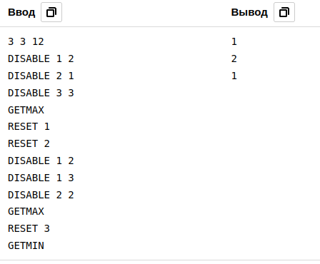

# Коля и датацентры

У каждой крупной IT-компании рано или поздно возникает необходимость иметь свои датацентры.

Коля недавно устроился в одну из таких компании стажёром. У компании есть *N* датацентров,
каждый из которых имеет ровно по *M* серверов.

Из-за наплыва большого трафика и спешки в постройке датацентров, некоторые из серверов в каком-то из них выключаются,
помогает только перезапуск всего датацентра. При этом каждый из датацентров характеризуется двумя неотрицательными 
целыми числами:

*Ri* — число перезапусков i-го датацентра и *Ai* — число рабочих (не выключенных) серверов на текущий момент в 
i-м датацентре.

Руководитель поручил Коле задачу по сбору некоторых метрик, которые помогут компании в дальнейшем в улучшении
датацентров. Для этого Коле дали список из *Q* событий, которые произошли за текущий день. Но, так как Коля ещё
довольно неопытен в этом деле, он просит вас помочь с этим.

## Формат ввода

В первой строке входных данных записано 3 положительных целых числа *n, m, q (1≤q≤10^5,1≤n⋅m≤10^6,1≤q≤10^5,1≤n⋅m≤10^6)*
— число датацентров, число серверов в каждом из датацентров и число событий соответственно.

В последующих qq строках записаны события, которые могут иметь один из следующих видов:

RESET i — был перезагружен i-й датацентр (1≤i≤n)

DISABLE i j — в i-м датацентре был выключен j-й сервер (1≤i≤n,1≤j≤m)

GETMAX — получить номер датацентра с наибольшим произведением Ri∗Ai

GETMIN — получить номер датацентра с наименьшим произведением Ri∗Ai

## Формат вывода

На каждый запрос вида GETMIN или GETMAX выведите единственное положительное целое число — номер датацентра,
подходящий под условие. В случае неоднозначности ответа выведите номер наименьшего из датацентров.

### Пример 1

### Пример 2

### Примечания

Обратите внимание на 2 пример. DISABLE приходится для уже выключенного сервера.
В данном случае сервер по-прежнему остаётся выключенным.

